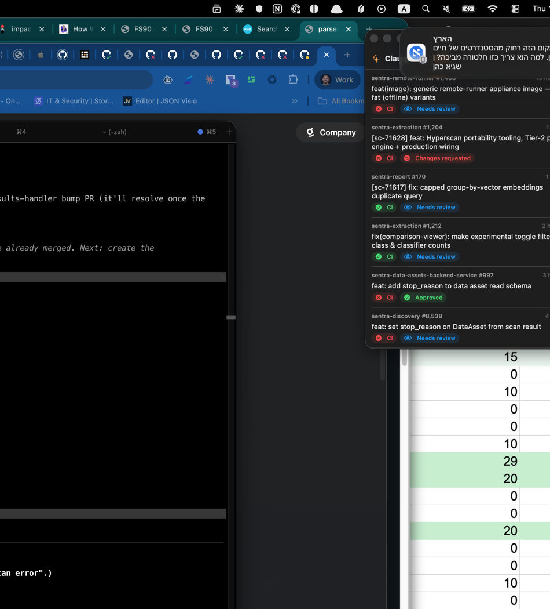

# Claude PR Hover

A floating macOS panel that shows all your open, non-draft pull requests generated with Claude Code — so you always see what's ready for review or merge.



## What it shows

PRs are found via GitHub search: open PRs authored by you whose body contains "Generated with Claude Code" (the marker Claude Code adds to every PR it creates), sorted by most recently updated, drafts excluded. Each row shows:

- Repo and PR number, title, and last-updated time
- CI status (green check / red X / yellow pending)
- Review state (Approved / Needs review / Changes requested)
- A merge-conflict warning when the PR can't merge cleanly

Click a row to open the PR in your browser. The list refreshes every 60 seconds.

## Requirements

- macOS 13+
- [`gh` CLI](https://cli.github.com) installed and authenticated (`gh auth login`)

## Build & run

```sh
swift build -c release
.build/release/ClaudePRHover &
```

The panel hovers at the top-right of your screen (always on top, visible on all Spaces) and can be dragged anywhere. A menu-bar icon (✨) lets you show/hide the panel, refresh, or quit. There is no dock icon.

To test the data fetch without launching the GUI:

```sh
.build/debug/ClaudePRHover --dump
```

## Start at login

```sh
swift build -c release
mkdir -p ~/.local/bin && cp .build/release/ClaudePRHover ~/.local/bin/
```

Then add `~/.local/bin/ClaudePRHover` as a Login Item in System Settings → General → Login Items.
